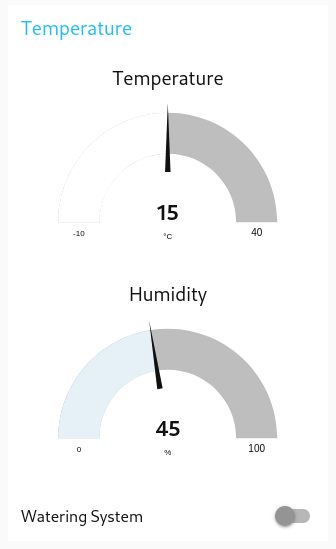
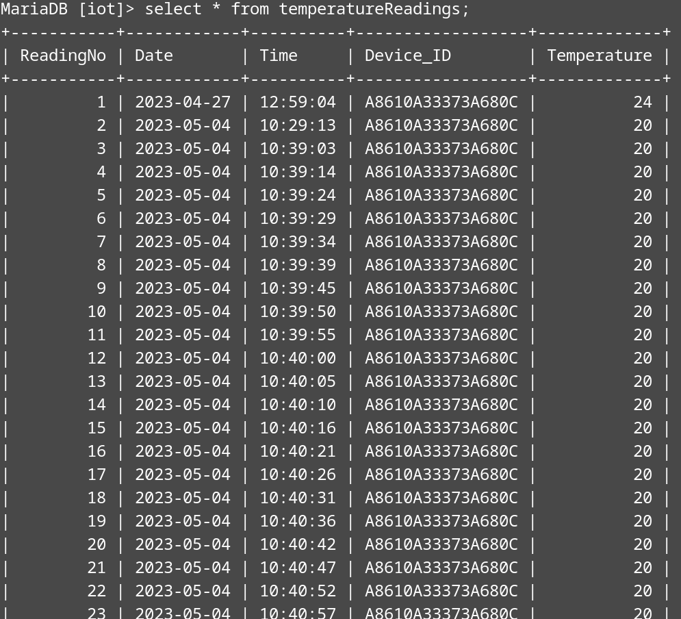

# Harvest Predictor

## Table of Contents

<!-- vscode-markdown-toc -->
- [Harvest Predictor](#harvest-predictor)
  - [Table of Contents](#table-of-contents)
  - [Introduction](#introduction)
  - [The Current Method and its Associated Issues](#the-current-method-and-its-associated-issues)
  - [Understanding Growing Degree Days (GDD)](#understanding-growing-degree-days-gdd)
  - [System Overview](#system-overview)
    - [Infographic](#infographic)
    - [Detailed Explanation](#detailed-explanation)
    - [Node-RED Flow](#node-red-flow)
  - [Setup Guide](#setup-guide)
  - [Demonstration](#demonstration)
  - [Further Work](#further-work)
  - [References](#references)

<!-- vscode-markdown-toc-config
	numbering=false
	autoSave=false
	/vscode-markdown-toc-config -->
<!-- /vscode-markdown-toc -->

## Introduction

As part of one of my third year university modules I visited a small, regenerative farm. They expressed issues with not having time to manually calculate when their crops would be ready to harvest. This prevented them from organising labour and machinery in advance when they are in high demand. 

I used this as inspiration for a project in another module. The goal was to use an IoT device to help farmers automatically predict their crop harvest dates, allowing them to arrange additional resources in advance.

My long-term goal for this project is for it to be an open-source solution to help farmers plan ahead, to reduce waste while increasing yields and profits.

**Note: The current version of the Harvest Predictor provides real-time data on growing degree days (GDD) and harvest percentages for each crop. While it doesn't directly display estimated harvest dates, this information equips farmers with valuable insights to plan their harvest activities effectively.**

## The Current Method and its Associated Issues

Currently the farmers estimate harvest dates by calculating the number of "growing degree days" (GDD) accumulated by each crop. 

To do these calculations, they must take manual temperature readings in each polytunnel and field multiple times a day. They then input these readings into a spreadsheet where the accumulated growing degree days (GDD) are automatically calculated for each crop. From this, they can determine how close each crop is to harvest, as each has a GDD threshold to meet. This helps them to plan when to book resources.

The issue with their current method is that it is very time consuming, taking around 2 hours each day. This is valuable time when that person could be working on actively tending to the crops. As a result of this, they tend to start the season with good intentions, but they are soon too busy to spend time on these calculations. This results in them being unable to plan thier resources ahead of harvest time. 

They need a way to passively monitor their crops and calculate their accumulated growing degree days. The overarching need at the farm is for daily tasks to become automated.

## Understanding Growing Degree Days (GDD)

Growing Degree Days (GDDs) are a way to estimate crop development and predict
harvest times. GDDs are the accumulated heat units of a crop [1].

Each crop has a baseline temperature, below which it will not grow. There is also a maximum temperature, but this doesn't usually need to be considered in the UK. Crops
have a GDD threshold (minimum and maximum). When the accumulated GDDs are between these values, this is when the crops should be harvested.

To calculate growing degree days, the temperature is taken throughout the day. From this, the average temperature for the day is recorded. The baseline temperature is deducted from the average temperature, and if this value is above 0, it is added to the accumulated GDDs of that crop. To calculate how close the crops are to harvest (as a percentage), the accumulated GDDs are divided by the minimum required GDDs and multiplied by 100. When the crop reaches 100%, it should be ready to harvest.

<figure align="center">
  
  <figcaption>Graph showing the temperature curve and upper and lower thresholds. The degree days are determined by calculating the area of the shaded sections [1]</figcaption>
</figure>

*GDDs can also be calculated through integration but the method described above is a simple way to approximate the area under the temperature curve.*

## System Overview

### Infographic

<figure align="center">
  
</figure>

### Detailed Explanation

The end device node comprises of An Arduino MKR 1310 connected to a temperature and humidity sensor, relay (watering system) and LCD. This device measures the temperature and humidity before displaying the readings on the LCD.

<figure align="center">
  
</figure>

These readings are also sent as a 5-byte payload (containing a flag, temperature
reading and humidity reading) to The Things Network via a LoRaWAN gateway with over-the-air authentication (OTAA). The payload is interpreted by a payload formatter which converts the bytes into their respective values (payloadType, temperature and humidity). The formatted payload is sent to the Node-RED flowchart via the MQTT protocol.

<figure align="center">
  
  <figcaption>Decoded payload in Node-RED</figcaption>
</figure>

In Node-RED, if the payload type is “Temp&Humid”, the temperature and humidity readings are displayed on gauges on the dashboard’s home page. The temperature reading is stored in the “temperatureReadings” SQL table. 

| <figure align="center"> <figcaption>Temperature and Humidity gauges on the dashboard</figcaption></figure> | <figure align="center"> <figcaption>"temperatureReadings" SQL table</figcaption></figure> |
| -------------------------------------------------------------------------------------------------------------------------------------------------------- | ------------------------------------------------------------------------------------------------------------------------------------------ |

When the farmer plants a new crop, they can go to the “Add Crop” page on the dashboard. Here they can enter the name of the crop, the date and time it was planted, the baseline temperature, minimum GDD and maximum GDD. When they click submit, the information is added to the “crops” database.

| <figure align="center"> <figcaption>Add Crop Form</figcaption></figure> | <figure align="center"> <figcaption>"crops" SQL table</figcaption></figure> |
| --------------------------------------------------------------------------------------------------------------- | -------------------------------------------------------------------------------------------------------------- |

Every hour (or when the user clicks the “Update” button on the “Monitor Crops” page), a flow is triggered. The temperature readings for the day are retrieved from the “temperatureReadings” SQL table. From this, the average temperature is calculated and stored in the “averageTemperatures” table. The date column of the table is a primary key, so if there is already an entry for today’s date, the entry will be updated rather than a new entry being created. This ensures that there is only one entry per day.

| <figure align="center"> <figcaption>Code to calculate average temperature</figcaption></figure> | <figure align="center"> <figcaption>"averageTemperatures" SQL table</figcaption></figure> |
| ------------------------------------------------------------------------------------------------------------------------------------------------ | ------------------------------------------------------------------------------------------------------------------------------------------ |

After a short delay, the crop data and average temperatures are retrieved from their respective tables. The degree days and harvest percentages are calculated for each crop before the “crops” table is updated with these new values.

<figure align="center">
  
  <figcaption>Code to calculate the degree days and harvest percentage for each crop</figcaption>
</figure>

After another short delay, the updated crops data is retrieved from the table before being reformatted and displayed for the user to see on the “Monitor Crops” page of the dashboard.

<figure align="center">
  
  <figcaption>Crops table on the “Monitor Crops” page of the dashboard</figcaption>
</figure>

To automate the watering process, a watering system has been implemented. If the humidity is below 50% or the user clicks the “Watering System” switch on the dashboard home page, a “1” is sent downlink to the Arduino. The Arduino checks for downlink communications every 2 minutes, and if a “1” is received, the watering system relay is switched on, and the LCD backlight goes blue. 

<figure align="center">
  
  <figcaption>Arduino IoT device with the watering system relay on and blue LCD backlight</figcaption>
</figure>

The relay status is returned to TTN with the payload type flag set to 1. After a 2-minute delay, Node-RED sends a “0” to the Arduino, and this causes the Arduino to turn off the watering system via the relay and change the LCD backlight back to yellow.

### Node-RED Flow

<figure align="center">
  
</figure>

## Setup Guide

For detailed instructions on setting up the Harvest Predictor, please refer to the [Setup Guide](SetupGuide.md).

## Demonstration

## Further Work

This project was designed to meet the criteria for an assignment. In reality I would change several aspects of the hardware design.

- Remove the LCD, relay and Grove carrier board

- Battery power the Arduino

- Put the electronics in a waterproof enclosure

I have several software changes which I would like to make;

- Ability to add multiple devices and dynamically generate UI elements for each device and crop

- Currently the system is reactive rather than predictive. I would like to used local, historical weather data averaged over many years to project when each crop will reach 100% of the required GDDs.

**The most important thing is to test the theory behind this solution.** The device needs to be run in-situ for a year to collect data. This will allow the durability of the device and accompanying software to be checked. It will also show how accurate the estimations are. This data could even serve as input for training a Machine Learning model, enhancing the precision of the predictions.

## References

1. https://ipm.ucanr.edu/WEATHER/ddconcepts.html 